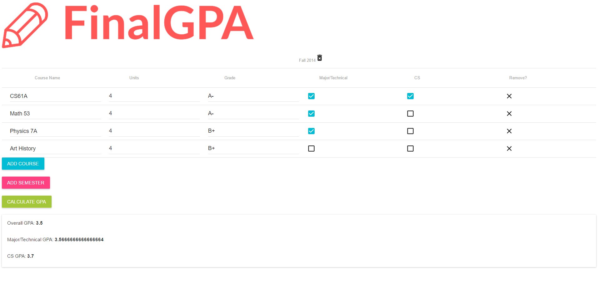

# FinalGPA
A GPA Calculator that calculates your overall, technical, and CS GPA at once. You simply add your semesters, courses for each semester, and whether these course are technical and/or CS, and all the work is done for you. Perfect for figuring out your highest GPA to put on a resume and keeping your stats from one semester to the next (the information is stored on your browser) so you do not have to recalculate every time.

###### Example Usage

You can use it here (hosted on Heroku): http://finalgpa.herokuapp.com/

Or you can use it locally:

1. Clone the repository:  
`git clone https://github.com/arb625/finalgpa.git`

2. Make sure you have node and npm installed: https://nodejs.org/en/download/

3. Run the express server locally:  
`node server.js`  
and go to [http://localhost:8080/](http://localhost:8080/)